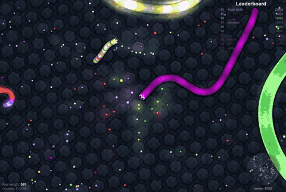

# Slither.io Jev Controller

An experimental, input-only controller for `slither.io` driven by TypeSafe Jev through the Vercel AI Gateway. The controller reads visible game state, asks Jev to choose among typed tactical routes, and keeps deterministic geometry, collision checks, food collection, boosts, and browser input in code.

The project uses the official `typesafe-ai` skill and the `typesafe-ai/jev` model. It does not use Jev Ultrafast, modify the game socket, change score or physics, or send screenshots to the model.

## What is included

- `src/play-slither-jev.py` — Gateway client, state loop, recording, KPI and retention handling.
- `src/slither-reflex.js` — 20 Hz input-only controller for collision checks, escape routes, food races, cut-ahead attacks, and bounded catch-up boosts.
- `src/observe-slither.js` — read-only adapter for the current slither.io client.
- `tests/test_catchup_v20.cjs` — representative geometry and actuation regression test.
- `tests/replay20-catchup-regression.json` — recorded poses used by that test.
- `docs/jev-time-kpi-results.json` — measured score/time results from prior runs.
- `docs/jev-vercel-v15-review.md` — design notes, evidence limits, and run review.

## Video policy

YouTube is the better public README link for the full run: it streams immediately, avoids GitHub's large-file limits, and makes a long gameplay recording easier to watch. The full verified run 19 MP4 is intentionally not committed here because it is about 474 MB. The public YouTube URL can be added below once it exists; this repository does not invent or reserve a URL.

**Full run:** YouTube link pending publication.

For a quick preview, an attack-focused highlight is embedded below. It shows Jev approaching other snakes, taking boosted cut-ahead lines, and moving through the crowded area around the early kills; it is not presented as proof that every nearby death was caused by the bot.



The inline preview is a 15-second, 480-pixel-wide animated GIF. For the higher-quality 70-second excerpt, use the [attack highlight MP4](media/jev-replay-19-attack-highlight.mp4) (9 MB, H.264, 960×644).

The source run retained the verified local recording at `outputs/jev-vercel-replay-19.mp4` outside this repository. For reproducible local artifacts, use a GitHub Release asset or an external object store rather than a normal Git blob.

## Requirements

- Python 3.12+
- Node.js 20+
- Chrome with a local CDP connection
- `browser-harness==0.1.13`
- `httpx[http2]==0.28.1`
- FFmpeg for recording finalization
- A Vercel AI Gateway key in `AI_GATEWAY_API_KEY` or `VERCEL_API_KEY`

The key is read at runtime from the environment, `.env`, or `~/.codex/.env`; it is never committed. Use a local `.env.example` as a reference and keep real credentials out of source control.

## Run

Start a dedicated Chrome profile with a CDP endpoint, install the two Python dependencies, and run from the repository root:

```sh
python -m venv .venv
.venv/bin/pip install 'browser-harness==0.1.13' 'httpx[http2]==0.28.1'
BU_NAME=slither-jev-game \
BU_CDP_URL=http://127.0.0.1:59328 \
.venv/bin/python src/play-slither-jev.py --until-death --name my-slither-run
```

`--until-death` continues one life until natural death. Time targets are KPIs, not stop conditions. The player name is `jev.bot`. A run keeps its MP4 only when it reaches Top 10 or 10,000 points; otherwise the MP4 and temporary frames are removed while JSON results and decision logs remain.

## Current score/time KPIs

| Milestone | Target |
| --- | ---: |
| 100 points | 60 seconds |
| 1,000 points | 180 seconds |
| 5,000 points | 600 seconds |
| 10,000 points | 900 seconds |

The KPI timestamps are first confirming observations, so they can lag the actual crossing by the sampling interval. Recorded score, rank, kills, and controller events remain separate; a planned attack or a safe input is not counted as a kill.

## Verification

The included regression test can be run with:

```sh
node tests/test_catchup_v20.cjs
```

It checks bounded parallel catch-up acceleration, rejects equal-speed and distant pursuits, and rejects an approach blocked by a body. The test is a geometry/input simulation, not proof that a live game will survive or produce a kill.

## Safety and scope

This is an experimental browser automation project. It is intended for a user-owned game session. Keep credentials local, use a dedicated browser profile, and review the target site's rules before running it.

## License

MIT. See [LICENSE](LICENSE).
